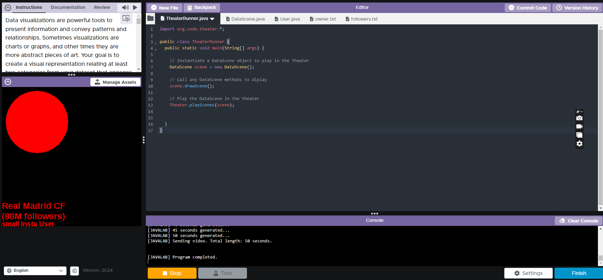

# Unit 4 - Abstract Art Project

## Introduction

Data visualizations are powerful tools to present information and convey patterns and relationships. Sometimes visualizations are charts or graphs, and other times they are more abstract pieces of art. Your goal is to create a visual representation relating at least two categories from your dataset that engages your viewer and encourages them to learn more about your chosen topic.

## Requirements

Use your knowledge of object-oriented programming, one-dimensional (1D) arrays, and algorithms to create your data visualization program:

- **Create at least two 1D arrays** – Create at least two 1D arrays to store the data that will make up your visualization.
- **Implement one or more algorithms** – Implement one or more algorithms that use two-way or multi-selection statements with compound Boolean expressions to analyze the data.
- **Use methods in the Math class** – Use one or more methods in the Math class in your program, such as to perform calculations on the values in your dataset and display the results, choose random values from the dataset, or display images or shapes at random locations.
- **Create a visualization** – Create an image or animation that conveys the story of the data by illustrating the patterns or relationships in the data.
  Note: This may be abstract! Others do not necessarily need to know what the story or pattern is right away, but you do need to be able to explain it to them.
- **Document your code** – Use comments to explain the purpose of the methods and code segments and note any preconditions and postconditions.

## Dataset

Include a hyperlink to the source of your dataset used for this project. Additionally, provide a short description of each column used from the dataset, and the data type.

Dataset: https://docs.google.com/spreadsheets/d/1RkQ1iMvTLIzYaPRcqNUXR6vdvAXIwISO1ji6bWJRzJo/edit?usp=sharing

- **Owner** (String) - name of the owner of the instagram account
- **Followers** (int) - number of people who follow the person (in the millions)

## UML Diagram

Put and image of your UML Diagram here. Upload the image of your UML Diagram to your repository, then use the Markdown syntax to insert your image here. Make sure your image file name is one work, otherwise it might not properly get display on this README.

 UML Diagram.png>)

## Video Demo

Record a short video of your abstract art animation to display here on your README. You can do this by:

- Screen record your project running on Code.org.
- Upload that recording to YouTube.
- Take a thumbnail for your image.
- Upload the thumbnail image to your repo.
- Use the following markdown

## Description

For this project, we had the user explore the different following amounts of the most followed people on instagram. This program would traverse the users list and randomly display the owners of the account and the amount of followers they have. The program will then use the draw elipses method to show a visual representation of the amount of followers a user has as circles. The colors of the words and shapes displayed change depending on the amount of followers the instagram user may have. Using a multi-selection statement, it determines whther the user displayed is a small insta user, a "mid" insta user, or big insta user.